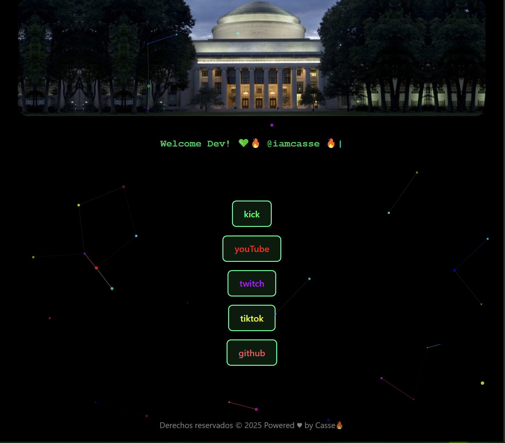

# 🔗 Links TikTok - Personal Link Tree

Una aplicación web moderna que actúa como una página de enlaces personalizada (linktree) para @iamcasse, desarrollada con React y Vite. Incluye efectos de partículas interactivos y una interfaz moderna con efectos de escritura.

## ✨ Características

- 🎨 **Interfaz moderna** con animaciones y efectos visuales    
- ✨ **Efectos de partículas** interactivos usando TSParticles
- ⌨️ **Efecto de máquina de escribir** para texto dinámico
- 📱 **Diseño responsivo** adaptable a diferentes dispositivos
- 🔗 **Enlaces sociales** organizados de manera atractiva
- 🚀 **Rendimiento optimizado** con Vite

## 🛠️ Tecnologías Utilizadas

- **React 19** - Biblioteca de JavaScript para la interfaz de usuario
- **Vite** - Herramienta de construcción y desarrollo rápido
- **TSParticles** - Efectos de partículas interactivos
- **CSS Modules** - Estilos modulares y encapsulados
- **ESLint** - Linting de código para mantener calidad

## 🌐 Enlaces Incluidos

- 🎮 **Kick**: [kick.com/iamcasse](https://kick.com/iamcasse)
- 📺 **YouTube**: [@iamcasse](https://www.youtube.com/@iamcasse)
- 🎮 **Twitch**: [twitch.tv/iamcasse](https://www.twitch.tv/iamcasse)
- 📱 **TikTok**: [@iamcasse](https://www.tiktok.com/@iamcasse)
- 💻 **GitHub**: [github.com/iamcasse](https://github.com/iamcasse)

## 🚀 Instalación y Uso

### Prerrequisitos

- Node.js (versión 18 o superior)
- npm o yarn

### Instalación

1. **Clona el repositorio**

   ```bash
   git clone https://github.com/segLayza/Links-Tiktok.git
   cd Links-Tiktok
   ```

2. **Instala las dependencias**

   ```bash
   npm install
   ```

3. **Inicia el servidor de desarrollo**

   ```bash
   npm run dev
   ```

4. **Abre tu navegador** y ve a `http://localhost:5173`

### Scripts Disponibles

```bash
# Desarrollo
npm run dev          # Inicia el servidor de desarrollo

# Construcción
npm run build        # Construye la aplicación para producción

# Linting
npm run lint         # Ejecuta ESLint para revisar el código

# Vista previa
npm run preview      # Vista previa de la construcción de producción
```

## 📁 Estructura del Proyecto

```
Links-Tiktok/
├── public/
│   └── vite.svg
├── src/
│   ├── assets/
│   │   ├── banner.jpeg
│   │   ├── react.svg
│   │   └── wplearnong.jpg
│   ├── components/
│   │   ├── Banner.jsx
│   │   ├── CasseBackground.jsx
│   │   ├── Footer.jsx
│   │   ├── IteraLinks.jsx
│   │   ├── Link.jsx
│   │   ├── Typewriter.jsx
│   │   ├── Welcome.jsx
│   │   └── config/
│   │       └── particles-config.js
│   ├── styles/
│   │   └── StyleGr.module.css
│   ├── utilities/
│   │   └── Links.js
│   ├── App.jsx
│   ├── App.css
│   ├── index.css
│   └── main.jsx
├── eslint.config.js
├── index.html
├── package.json
├── README.md
└── vite.config.js
```

## 🎨 Componentes Principales

- **`Banner`**: Componente de banner principal
- **`CasseBackground`**: Fondo con efectos de partículas
- **`Welcome`**: Mensaje de bienvenida con efecto typewriter
- **`IteraLinks`**: Contenedor que itera sobre los enlaces
- **`Link`**: Componente individual para cada enlace
- **`Typewriter`**: Efecto de máquina de escribir
- **`Footer`**: Pie de página

## ⚙️ Personalización

### Modificar Enlaces

Edita el archivo `src/utilities/Links.js` para agregar, modificar o eliminar enlaces:

```javascript
let links = [
  { name: "kick", url: "https://kick.com/tu-usuario" },
  { name: "youTube", url: "https://www.youtube.com/@tu-usuario" },
  // Agrega más enlaces aquí
];
```

### Personalizar Estilos

Los estilos están organizados en `src/styles/StyleGr.module.css` usando CSS Modules para evitar conflictos de nombres.

### Configurar Partículas

La configuración de partículas se encuentra en `src/components/config/particles-config.js`.

## 🌐 Deployment

### Netlify/Vercel

1. Construye el proyecto: `npm run build`
2. El directorio `dist/` contiene los archivos listos para producción
3. Sube el contenido de `dist/` a tu servicio de hosting preferido

### GitHub Pages

```bash
npm run build
# Sube el contenido de dist/ a la rama gh-pages
```

## 🤝 Contribución

1. Fork el proyecto
2. Crea una rama para tu feature (`git checkout -b feature/AmazingFeature`)
3. Commit tus cambios (`git commit -m 'Add some AmazingFeature'`)
4. Push a la rama (`git push origin feature/AmazingFeature`)
5. Abre un Pull Request

## 📄 Licencia

Este proyecto es de código abierto y está disponible bajo la licencia MIT.

## 👤 Autor

**@iamcasse**

- GitHub: [@iamcasse](https://github.com/iamcasse)
- TikTok: [@iamcasse](https://www.tiktok.com/@iamcasse)

---

⭐ ¡No olvides dar una estrella al proyecto si te fue útil!
